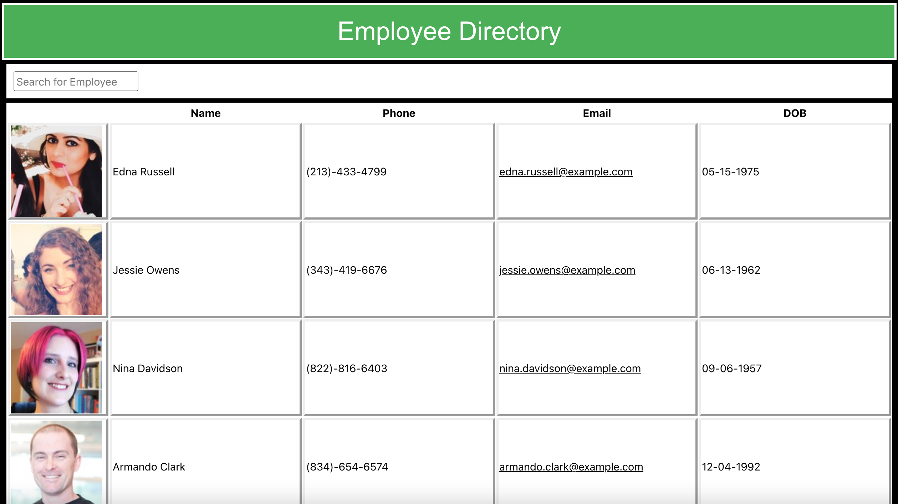

# Employee-Directory

# Table of Contents

-[Description](#description)
-[Installation](#installation)
-[Usage](#usage)
-[Contribution](#contribution)
-[Test](#test)
-[Questions](#questions)

# Description:

* This Employee Directory allows you to view up to 200 employess, sort and/or filter by name. 

# Installation:

* Installation of react modules needed.

# Usage:

* Search through your employee directory. 

# Contribution:

* Commit your update suggestions to GitHub for review and to be merged

# Test:

* None

* Click on the link below to view the live app.
-[Link to the live app](https://hectordiazjr.github.io/Employee-Directory/)
*Click on the link below to view the Repo.
-[Link to the repo](https://github.com/HectorDiazJr/Employee-Directory)

* Below are screen shots of the app.

# Questions:
Click on the link below to go to my GitHub page, for additional questions:
-[GitHub Portfolio](https:github.com/hectordiazjr)

Email me at hectordiaz1103@gmail.com with further questions